# 4 Concise Specifications for DC/TMD Examination

## 4.1 Overview

The intended user of the Concise Specifications is the individual (clinician or researcher) who wishes to use empirically validated diagnostic criteria for temporomandibular disorders while retaining a simple examination. The verbal commands and associated procedures used for each component of the clinical examination are listed here in a table format for ready reference. The reader should refer to Section 2 (General Instructions) for the full context of the examination. Full description of the procedures is provided in Section 3, and the fully operationalized version of these procedures is provided in Section 5. Figures, as referenced below, are found in Section 7. The enumeration of the examination procedures in this section corresponds to that in Section 5 as well as on the DC/TMD Examination Form (Section 8).

## 4.2 Examination-related Pain Interview

Inform the patient that s/he might experience pain during the clinical exam, and if so, s/he will be asked additional questions. When this sequence of question and response is used as part of the exam, the specifications (below) indicate "Conduct Examination-related Pain Interview." The detailed version is in Section 6.

***Familiar pain.*** If the patient reports pain as a result of an examination procedure, then ask the patient if it is "familiar pain", that is, pain "similar" or "like" the pain s/he has experienced in the last 30 days in the same region (i.e., his or her pain complaint). Remind the patient that you are trying to replicate or duplicate his or her pain so that you can locate the source of the pain.

***Familiar headache.*** If the patient reports pain in the temples as a result of an examination procedure, then ask the patient if it is "familiar headache", that is, pain similar or like the headache s/he has experienced in the temple area (s) in the last 30 days.

***Referred pain.*** If the patient reports familiar pain as a result of muscle or TMJ palpation or familiar headache as a result of temporalis muscle palpation, then the palpation is repeated and the patient is asked if s/he felt pain anywhere else beyond the immediate area of the examiner's palpation. It is considered *referred pain* if s/he reports pain beyond the boundary of the muscle or joint being palpated (i.e., perceived in another structure). It is not referred pain if s/he reports pain extending beyond the area of provocation but only within the boundary of the muscle or joint.

***Efficient Completion of the Examination-related Pain Interview.*** After several positive responses from the pain provoking procedures, the examiner can instruct the patient to respond in an abbreviated form. For example, the patient might be instructed to report, in response to positive palpation findings, as follows: "yes, familiar" or "yes, not familiar" in order to eliminate the repetitive asking of whether positive pain findings are familiar or not.

## 4.3 Measurements

Measurements are rounded down to the nearest whole mm and recorded only as integer numbers.

## 4.4 Completion of examination form

The examination form is organized so that a 'no' response in any multi-response field (e.g., pain from maximum unassisted opening in the temporalis muscle) will complete that set of response options; in contrast, a 'yes' response requires that the remainder of the response options (e.g., familiar pain, familiar headache, and referred pain) be completed.

## 4.5 Specifications

---

### E1. Examiner Confirmation of Pain and Headache Locations

| EXAM ITEM | COMMUNICATION TO PATIENT | EXAMINER PROCEDURE |
|-----------|--------------------------|-------------------|
| **Scope of examination: anatomic areas of interest** | Inform the patient that his or her head and face will be examined with respect to the areas as indicated. | - The examiner touches bilaterally the overall areas of the temporalis, masseter, TMJ, and posterior mandibular and submandibular muscle areas. - The examiner informs the patient that pain from the inside of the mouth should also be reported. |

**Figure 1:** Examiner touches each area: temporalis, TMJ, masseter, posterior/sub-mandibular

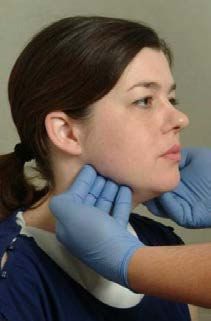 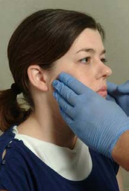 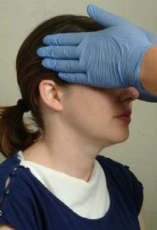 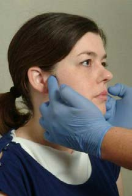

| EXAM ITEM | COMMUNICATION TO PATIENT | EXAMINER PROCEDURE |
|-----------|--------------------------|-------------------|
| **E1a - Location of pain in the last 30 days** | Ask the patient if s/he has experienced any pain in areas just identified via touch in *the last 30 days*.  If s/he answers "YES", ask him or her to point with one fingertip to each of the areas where s/he has felt pain *in the last 30 days*.  IF "YES", tell him or her that you want to confirm where s/he is reporting pain. | - Examiner touches the reported area(s) of pain to confirm that the pain is located in a masticatory structure(s). |

**Figures 2 & 3:** Patient pain location reporting and examiner confirmation

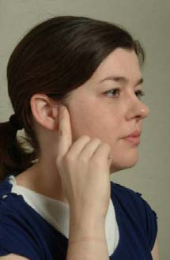 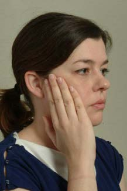 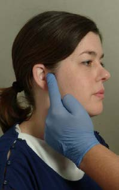 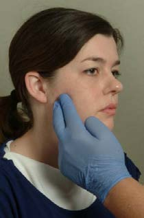 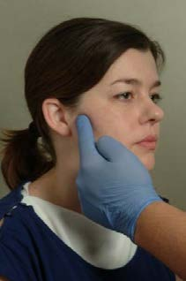

| EXAM ITEM | COMMUNICATION TO PATIENT | EXAMINER PROCEDURE |
|-----------|--------------------------|-------------------|
| **E1b - Location of headache in the last 30 days** | Ask the patient if s/he has experienced any headache in *the last 30 days*.  If s/he answers "YES", ask him or her to point with one fingertip to each of the areas where s/he has felt headache *in the last 30 days*.  IF "YES", tell him or her that you want to confirm where s/he is reporting headache. | - Examiner touches the reported area(s) of pain to confirm the headache location(s). |

---

### E2. Incisal Relationships

| EXAM ITEM | COMMUNICATION TO PATIENT | EXAMINER PROCEDURE |
|-----------|--------------------------|-------------------|
| **Select maxillary and mandibular reference teeth** | \<none\> | - Typically the measurements done in this section use either the right or left pair of maxillary and mandibular central incisors. - Use the same two reference teeth for all subsequent measurements. |

| EXAM ITEM | COMMUNICATION TO PATIENT | EXAMINER PROCEDURE |
|-----------|--------------------------|-------------------|
| **Reference line – vertical overlap** | Ask patient to gently place his or her back teeth completely together (where they fit together the best). | - With a pencil, mark the horizontal reference line where the incisal edge of the mesial-distal center of the maxillary reference tooth overlaps the opposing mandibular incisor. - If anterior cross-bite, reverse the instructions. |

**Figure 4:** Reference lines - horizontal line on mandibular incisor

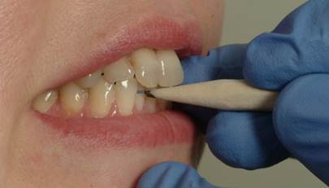

| EXAM ITEM | COMMUNICATION TO PATIENT | EXAMINER PROCEDURE |
|-----------|--------------------------|-------------------|
| **Reference line – mandibular reference midline** | If needed, then ask patient to open slightly so that the mandibular embrasures can be observed. | - Assess maxillary and mandibular dental midlines; coincidental (< 1mm) maxillary and mandibular dental midline is considered 0 mm discrepancy and requires no further attention. - If midline ≥ 1 mm, then mark vertical line on face of maxillary reference tooth and extend down to the mandibular reference tooth. Record "N/A" on exam form. - Two other options are described in Section 5. |

**Figures 5 & 6:** Midline reference methods

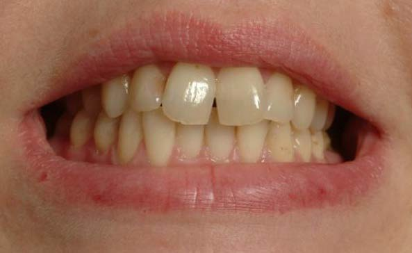 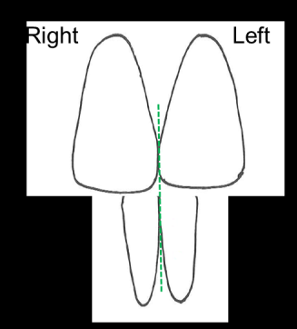 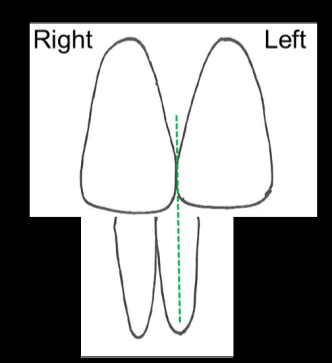 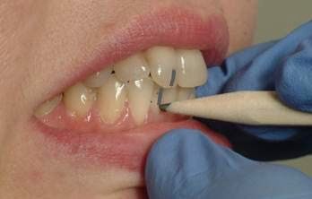

| EXAM ITEM | COMMUNICATION TO PATIENT | EXAMINER PROCEDURE |
|-----------|--------------------------|-------------------|
| **Horizontal incisal overjet** | Ask patient to gently place his or her back teeth completely together (where they fit together the best). | - Verify teeth are in maximum intercuspation but without clenching. - Measure the distance from the midpoint of the labial surface of the selected maxillary central incisor to the labial surface of the opposing mandibular incisor on a horizontal plane. - If anterior cross-bite is present, then mark "negative". |

**Figure 7:** Horizontal overlap measurement

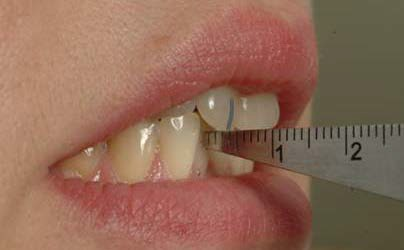

| EXAM ITEM | COMMUNICATION TO PATIENT | EXAMINER PROCEDURE |
|-----------|--------------------------|-------------------|
| **Vertical incisal overlap** | Ask patient to open sufficiently to measure the vertical overlap. | - Measure the distance that the maxillary tooth overlaps the mandibular tooth. - If an anterior open-bite is present, measure the distance between the edges of the maxillary and mandibular incisors and mark "negative". - If anterior cross-bite is present, reverse the above instructions. |

**Figure 8:** Vertical overlap measurement

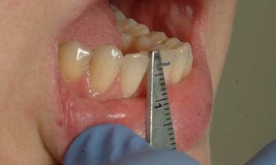

---

### E3. Opening Pattern (Supplemental)

| EXAM ITEM | COMMUNICATION TO PATIENT | EXAMINER PROCEDURE |
|-----------|--------------------------|-------------------|
| **Opening Pattern** | Ask patient to open as wide as s/he can, even if it is painful. | - Observe if the opening movement is: straight (no observed deviation: < 2mm to either side), corrected (i.e., S- or C-curve deviation ≥ 2 mm), or uncorrected (i.e., lateral deviation ≥ 2 mm). For uncorrected deviation, observe with full opening if the deviation is to the right or left side. |

**Figures 9 & 10:** Opening pattern assessment

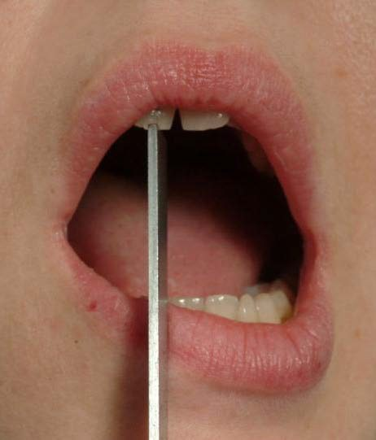 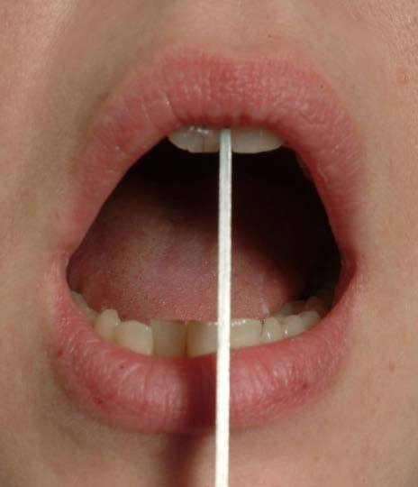

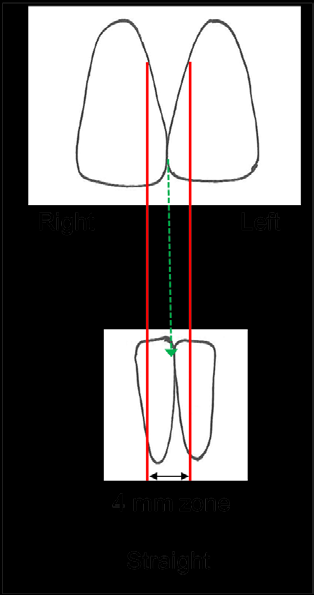  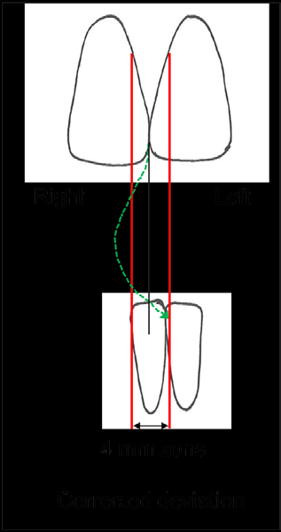 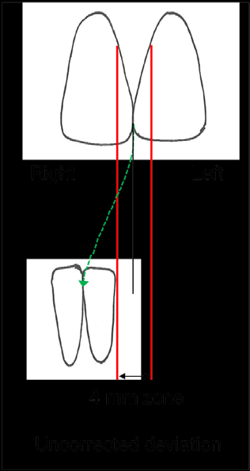

---

### E4. Open Movements

| EXAM ITEM | COMMUNICATION TO PATIENT | EXAMINER PROCEDURE |
|-----------|--------------------------|-------------------|
| **E4A. Pain-free opening** | Ask patient to open his or her mouth as wide as he can without feeling any pain or, if s/he is already experiencing pain, to open as wide as s/he can without increasing his or her current pain. | - Measure the interincisal distance between the maxillary and mandibular reference teeth. |

**Figure 11:** Pain free opening measurement

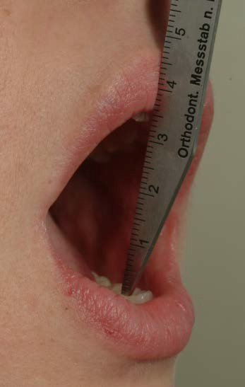

| EXAM ITEM | COMMUNICATION TO PATIENT | EXAMINER PROCEDURE |
|-----------|--------------------------|-------------------|
| **E4B. Maximum unassisted opening** | Ask patient to open as wide as s/he can, even if it is painful. | - Measure the interincisal distance between the maxillary and mandibular reference teeth. |

**Figure 12:** Maximum unassisted opening measurement

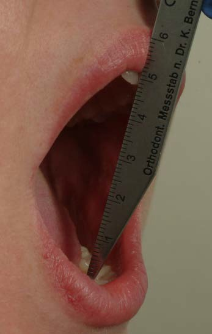

| EXAM ITEM | COMMUNICATION TO PATIENT | EXAMINER PROCEDURE |
|-----------|--------------------------|-------------------|
| **E4B. Post-MUO pain** | Ask patient to identify with his or her finger(s) all of the areas where pain was experienced. Conduct Pain Interview. | - Confirm the anatomical structure(s) that the patient identified as the site(s) of his or her pain. |

**Figure 13:** Patient points to pain area, examiner confirms structure

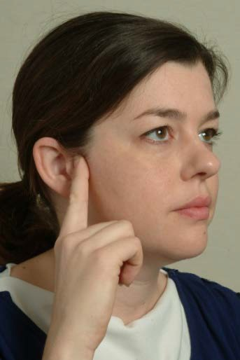 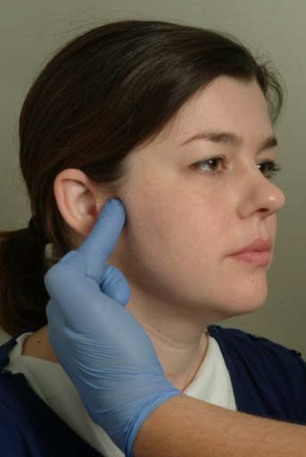

| EXAM ITEM | COMMUNICATION TO PATIENT | EXAMINER PROCEDURE |
|-----------|--------------------------|-------------------|
| **E4C. Maximum assisted opening** | Obtain permission from the patient to "stretch" his or her mouth open further. Inform the patient that if s/he wants you to stop, to raise his or her hand. | - After the patient opens, place thumb on the patient's maxillary central incisors, and cross index finger over to the mandibular central incisors. - Using moderate pressure, push the mouth open further. - Measure the interincisal distance between the maxillary and mandibular teeth. - It is critical that this measurement is at least the same as was measured for Maximum Unassisted Opening. |

**Figure 14:** Pain localization during maximum opening

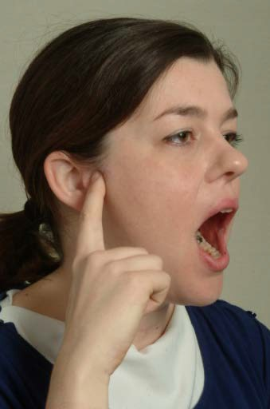 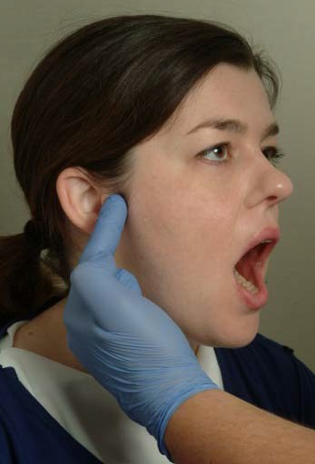

| EXAM ITEM | COMMUNICATION TO PATIENT | EXAMINER PROCEDURE |
|-----------|--------------------------|-------------------|
| **E4C Post–MAO pain** | Ask patient to identify with his or her finger(s) all of the areas where pain was experienced as a result of the examiner's manipulation. Conduct Pain Interview. | - Confirm the anatomical structures that the patient identified as the sites of his or her pain. |

**Figures 15 & 16:** Maximum assisted opening - scissors position; Patient points to pain, examiner confirms

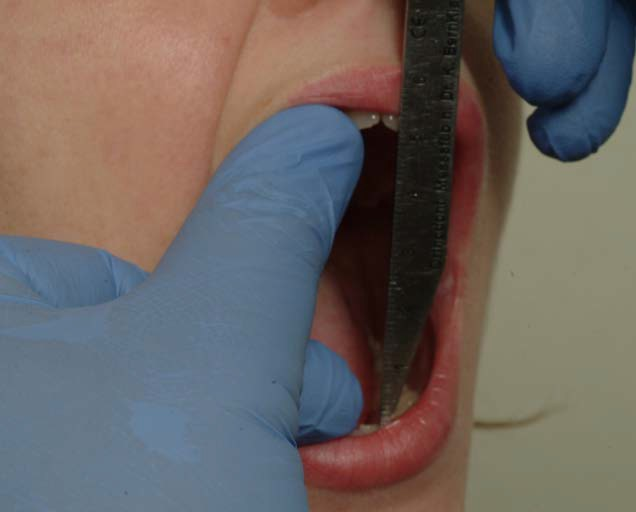  

| EXAM ITEM | COMMUNICATION TO PATIENT | EXAMINER PROCEDURE |
|-----------|--------------------------|-------------------|
| **E4D. Opening terminated** | \<none\> | - Record whether or not the patient raised his or her hand to terminate. |
| **E4E. Adjusting vertical measurements** *(see Section 2 for further detail)* | \<none\> | - The measurements of pain-free, maximum unassisted, and maximum assisted opening represent the gap between the incisal edges. - Total opening is the sum incisal overbite + the measured opening between incisal edges. |

---

### E5. Lateral & Protrusive Movements

| EXAM ITEM | COMMUNICATION TO PATIENT | EXAMINER PROCEDURE |
|-----------|--------------------------|-------------------|
| **E5A Right lateral excursion** | Ask patient to open slightly, and to move his or her jaw as far as s/he can to the right, even if it is painful. | - Measure from the maxillary reference midline to the mandibular reference midline. |

**Figure 17:** Right lateral excursion measurement

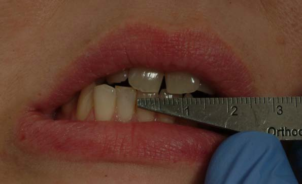

| EXAM ITEM | COMMUNICATION TO PATIENT | EXAMINER PROCEDURE |
|-----------|--------------------------|-------------------|
| **E5A Post excursion pain** | Ask patient to identify with his or her finger(s) all of the areas where pain was experienced with the movement. Conduct Pain Interview. | - Confirm the anatomical structure(s) that the patient identified as the site(s) of his or her pain. |

**Figure 18:** Patient points to pain areas during lateral movement

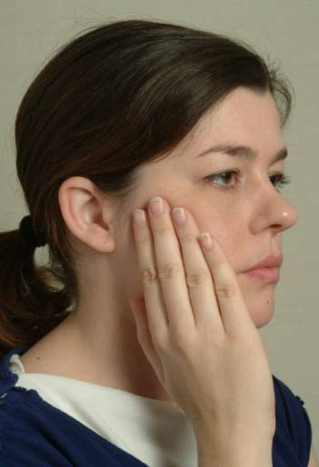 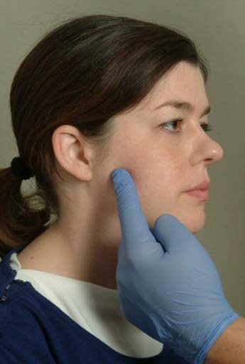

| EXAM ITEM | COMMUNICATION TO PATIENT | EXAMINER PROCEDURE |
|-----------|--------------------------|-------------------|
| **E5B Left lateral excursion** | Ask patient to open slightly, and to move his or her jaw as far as s/he can to the left, even if it is painful. | - Measure from the maxillary reference midline to the mandibular reference midline. |

**Figure 19:** Left lateral excursion measurement

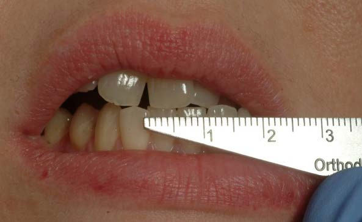

| EXAM ITEM | COMMUNICATION TO PATIENT | EXAMINER PROCEDURE |
|-----------|--------------------------|-------------------|
| **E5B Post excursion pain** | Ask patient to identify with his or her finger(s) all of the areas where pain was experienced with the movement. Conduct Pain Interview. | - Confirm the anatomical structure(s) that the patient identified as the site(s) of his or her pain. |

| EXAM ITEM | COMMUNICATION TO PATIENT | EXAMINER PROCEDURE |
|-----------|--------------------------|-------------------|
| **E5C Protrusive excursion** | Ask patient to open slightly, and to move his or her jaw as far as s/he can forward, even if it is painful. | - Measure the distance from the buccal surface of the mandibular tooth to the buccal surface of the maxillary tooth. |

**Figure 20:** Protrusion measurement

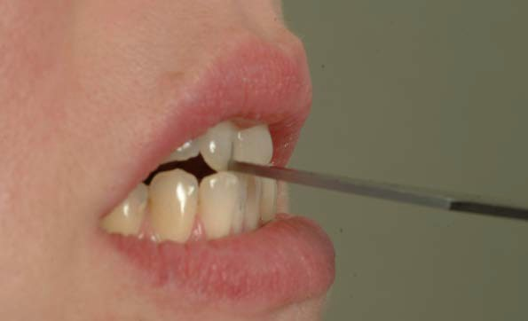 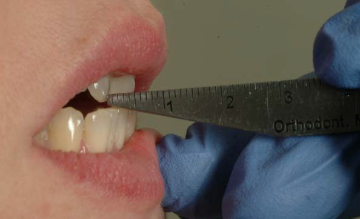

| EXAM ITEM | COMMUNICATION TO PATIENT | EXAMINER PROCEDURE |
|-----------|--------------------------|-------------------|
| **E5C Post protrusion pain** | Ask patient to identify with his or her finger(s) all of the areas where pain was experienced with the movement. Conduct Pain Interview. | - Confirm the anatomical structure(s) that the patient identified as the site(s) of his or her pain. |
| **E5D. Adjusting lateral and protrusive movements** *(see Section 2 for further detail)* | \<none\> | - In order to accurately compare right and left lateral movements and to report lateral range of motion, measured right and left lateral movements need to be adjusted by incorporating any midline deviation. - To report full protrusion, add the incisal overjet (horizontal overlap) to the protrusive measurement. |

**Figure 21:** Alternative lateral excursion measurement method

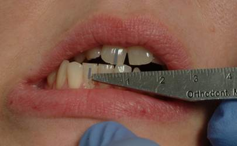 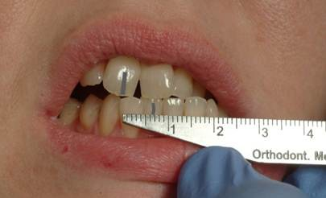

---

### E6. TMJ Noises During Open & Close Movements

| EXAM ITEM | COMMUNICATION TO PATIENT | EXAMINER PROCEDURE |
|-----------|--------------------------|-------------------|
| **Instructions regarding joint noises** | Inform patient that the jaw joints will be evaluated for noises and would like him or her to pay attention as well, since you will ask the patient at the end whether s/he heard or felt any noises. | - Fingers are placed over the TMJ(s). |

**Figure 22:** TMJ examination during open/close

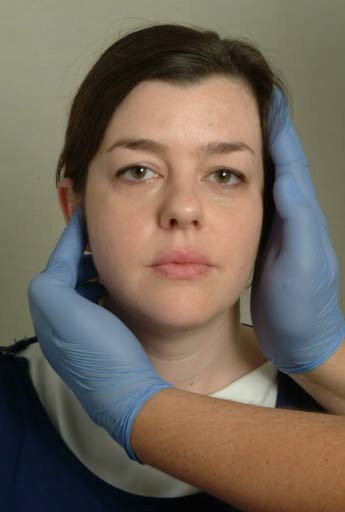 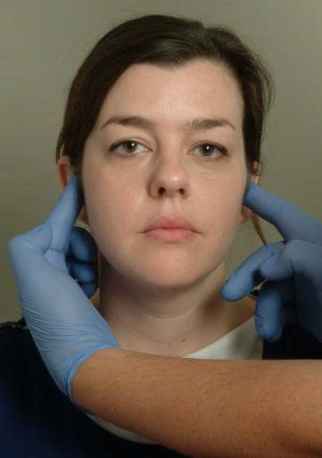

| EXAM ITEM | COMMUNICATION TO PATIENT | EXAMINER PROCEDURE |
|-----------|--------------------------|-------------------|
| **Full closure of mandible** | Ask patient to firmly place his or her back teeth completely together (where they fit together the best). | - Verify the teeth are in MICP. |
| **Opening and closing joint noises** | Ask patient to slowly open as wide as s/he can regardless of pain, and then slowly close until his or her back teeth are completely together again.  Repeat 2 more times. | - Record a noise as a "click" or "crepitus" if it is present on at least 1 of the 3 movements. Multiple types of noises can be present in a single joint. |
| **Patient report of joint noises** | Ask patient if s/he heard or felt any noises on either side when s/he opened and closed.  If YES, ask what type of noise s/he heard in the right and/or left side, including clicking, popping, snapping, grating, grinding, or crunching, or any other noises. | - Record patient's response |
| **Pain inquiry** | If patient reported clicking, popping or clicking noises, ask him or her if s/he experienced pain WHEN the noise occurred on one or both sides.  If pain was experienced, ask if the pain was familiar. | - Record patient's response |

---

### E7. TMJ Noises During Lateral & Protrusive Movements

| EXAM ITEM | COMMUNICATION TO PATIENT | EXAMINER PROCEDURE |
|-----------|--------------------------|-------------------|
| **TMJ noises during lateral and protrusive movements** | Ask patient to place his or her back teeth completely together (where they fit together the best), then to open slightly and move his or her jaw to the right as far as he can regardless of pain, and then move it back to its normal position and place his or her back teeth completely together. Repeat 2 more times.  Repeat same procedure with left lateral and protrusive movements. | - Place fingers over the TMJ(s) |

**Figure 23:** TMJ examination during lateral/protrusive

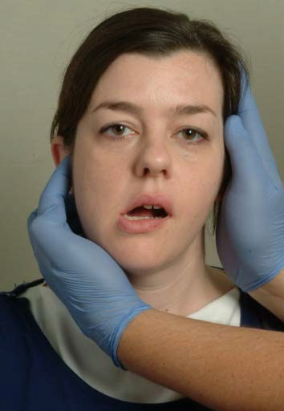 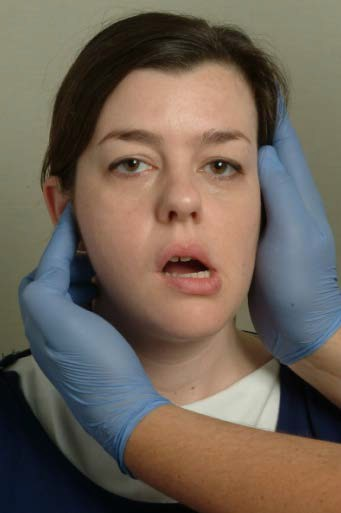 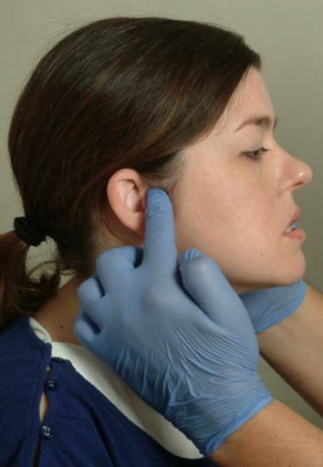

| EXAM ITEM | COMMUNICATION TO PATIENT | EXAMINER PROCEDURE |
|-----------|--------------------------|-------------------|
| **Inquiry regarding joint noises** | After completing each movement, ask patient if s/he heard or felt any noises on either side.  If YES, ask what noise s/he heard in the right and/or left side, including clicking, popping, snapping, grating, grinding, or crunching, or any other noises. | - Record patient's response |
| **Pain inquiry** | If patient reports clicking, popping or clicking noises, ask him or her if s/he experienced pain WHEN the noise occurred on one or both sides.  If pain was experienced, ask if the pain was familiar. | - Record patient's response. |

---

### E8. Joint Locking

| EXAM ITEM | COMMUNICATION TO PATIENT | EXAMINER PROCEDURE |
|-----------|--------------------------|-------------------|
| **Locking Closed** | For observed closed lock during the examination:  Ask patient if s/he can "unlock" his or her jaw. | - Inability to further open the mouth from a partially opened position, even momentarily, is positive. - Record if the patient or examiner reduced the closed lock or if it could not be reduced. |
| **Locking Open** | For observed open lock during the examination:  Ask patient if s/he can "unlock" his or her jaw. | - Inability to close the mouth from a wide-open position, even momentarily, is positive. - Also record if the patient or examiner reduced the open lock or if it could not be reduced. |

---

### E9. Muscle and TMJ Pain with Palpation

| EXAM ITEM | COMMUNICATION TO PATIENT | EXAMINER PROCEDURE |
|-----------|--------------------------|-------------------|
| **General** | \<none\> | Select coverage method for palpation of the larger muscles: comprehensive where every part of the muscle is palpated, or sampling areas of the muscle.  Select time duration for stimulus application: (a) 2 seconds for efficiency and ignoring referred pain diagnosis, (b) 5 seconds to minimize false negative diagnoses of referred pain and to better identify hyperalgesia, or (c) blend of 2 and 5 seconds. |

**Figure 24:** Palpation pathways for temporalis and masseter (diagram)

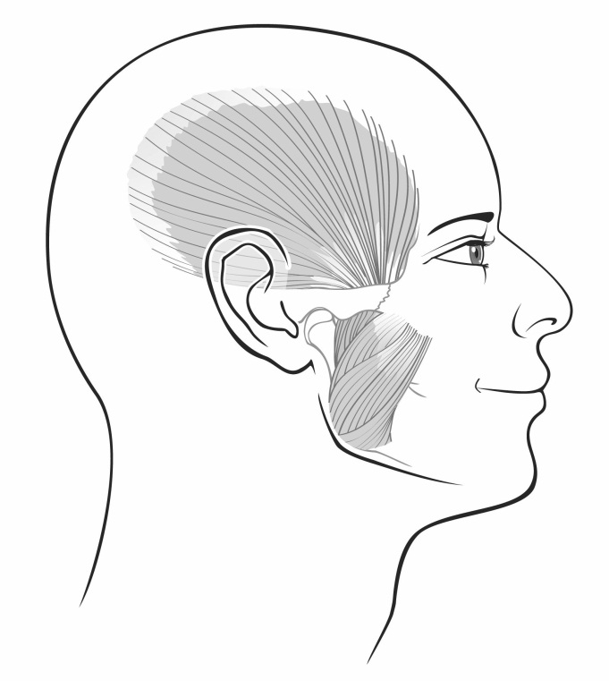

| EXAM ITEM | COMMUNICATION TO PATIENT | EXAMINER PROCEDURE |
|-----------|--------------------------|-------------------|
| **Temporalis and masseter muscles** | Inform the patient that you will ask him or her whether s/he feels pain or not when you press on different areas on his or her head and jaw. You can ask the patient to clench the teeth in order to identify the borders of the muscle.  Conduct Pain Interview. | - Palpate the masseter and temporalis muscles, one side at a time. - The intent is to palpate the whole muscle, including the tendonous attachments. To maximize systematic coverage, use three vertical bands for the temporalis and use three horizontal bands for the masseter. - Apply 1 kg of pressure. |

**Figure 25:** Finger pressure calibration using algometer

**Figure 26:** Temporalis palpation zones (orange areas diagram)

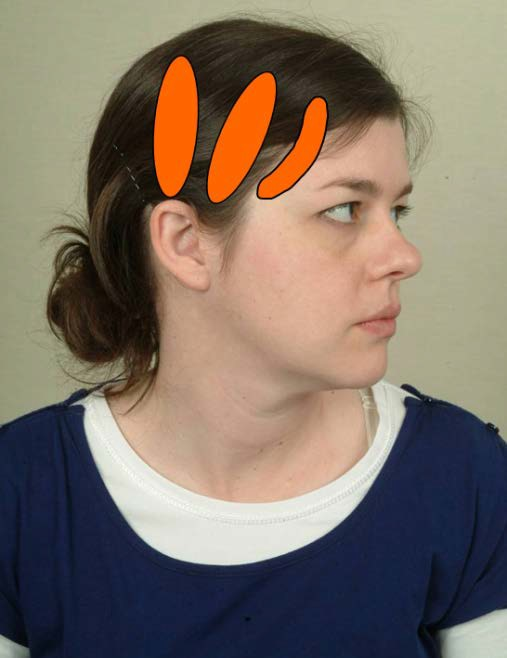

**Figure 27:** Temporalis palpation sequence - anterior, middle, posterior

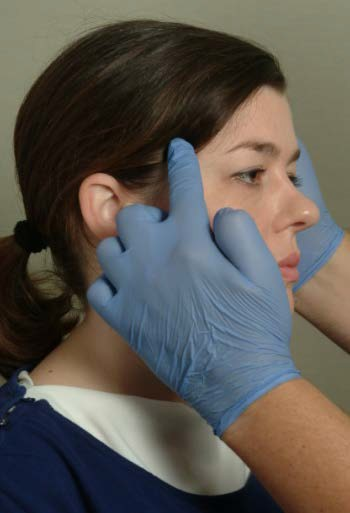 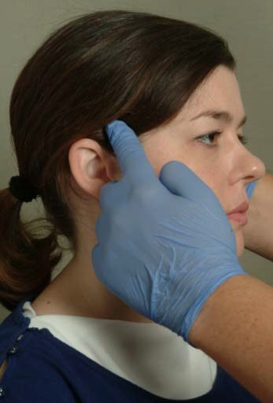 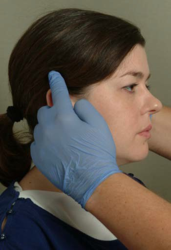

**Figure 28:** Masseter palpation zones (orange areas diagram)

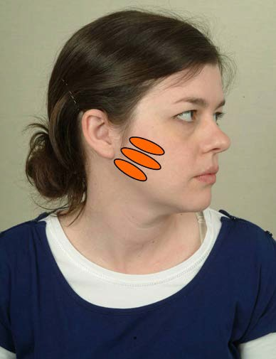

**Figure 29:** Masseter palpation sequence - origin, body, insertion

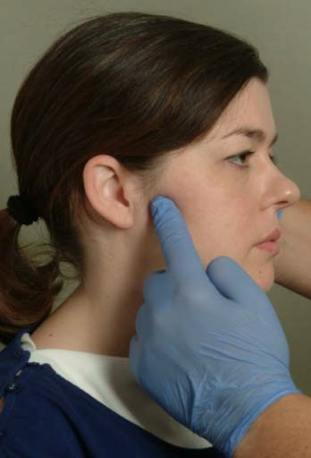 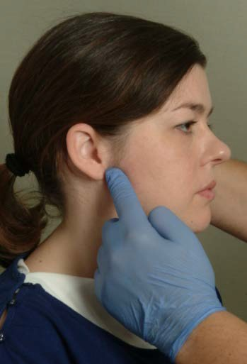 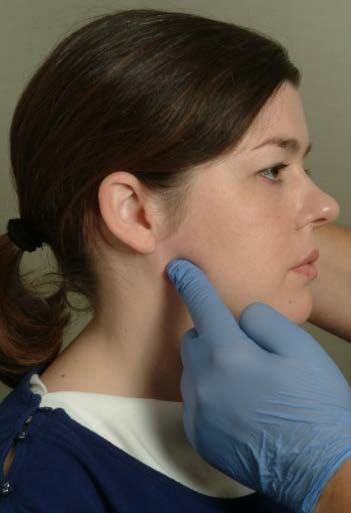

**Figure 30:** Alternative masseter insertion palpation

| EXAM ITEM | COMMUNICATION TO PATIENT | EXAMINER PROCEDURE |
|-----------|--------------------------|-------------------|
| **TMJ: lateral pole** | Ask the patient to slide his or her jaw forward and back in order to identify the lateral pole of the TMJ.  Conduct Pain Interview. | - Place index finger anterior to the tragus of the ear and over their lateral pole. - Apply 0.5 kg of pressure |

**Figures 31-33:** TMJ lateral pole palpation

   

| EXAM ITEM | COMMUNICATION TO PATIENT | EXAMINER PROCEDURE |
|-----------|--------------------------|-------------------|
| **TMJ: around lateral pole** | Ask patient to slide his or her jaw forward and back in order to identify the lateral pole of the TMJ. Then ask the patient, if necessary, to hold his or her jaw slightly forward, in order to maintain the TMJ lateral pole in an accessible position.  Conduct Pain Interview. | - Place index fingertip over lateral pole. - Roll your finger around the lateral pole of the condyle; your finger should orbit completely around the lateral pole without losing contact with the lateral pole. - Apply 1 kg of pressure |

**Figures 34-36:** Dynamic TMJ lateral pole palpation

   

---

### E10. Supplemental palpation sites (0.5 kg)

| EXAM ITEM | COMMUNICATION TO PATIENT | EXAMINER PROCEDURE |
|-----------|--------------------------|-------------------|
| **Posterior mandibular region** | Ask patient to relax his or her jaw.  Conduct Pain Interview. | This region is defined as that area between the insertion of the SCM and the posterior border of the mandible. |
| **Submandibular region** | Ask patient to relax his or her jaw.  Conduct Pain Interview. | This region is defined as the area 2 cm anterior to the angle of the mandible, and medial to the mandible. |

**Figures 37 & 39:** Posterior and submandibular muscle areas

  

**Figure 38:** 0.5 kg pressure calibration

| EXAM ITEM | COMMUNICATION TO PATIENT | EXAMINER PROCEDURE |
|-----------|--------------------------|-------------------|
| **Lateral pterygoid area** | Ask patient to open and move the jaw to the side that is being examined.  Conduct Pain Interview. | Ask patient to move his or her mandible toward the same side, and place finger on buccal side of alveolar ridge above the maxillary molars and move finger posteriorly, medially, and upward as far as possible, and palpate. |

**Figure 40:** Lateral pterygoid area palpation

| EXAM ITEM | COMMUNICATION TO PATIENT | EXAMINER PROCEDURE |
|-----------|--------------------------|-------------------|
| **Tendon of the temporalis** | Ask patient to open his or her mouth.  Conduct Pain Interview. | Place finger on anterior ridge of the coronoid process. Palpate on the superior aspect of the process. |

**Figure 41:** Temporalis tendon palpation

---

### E11. Examiner Comments

| EXAM ITEM | COMMUNICATION TO PATIENT | EXAMINER PROCEDURE |
|-----------|--------------------------|-------------------|
|  | \<none\> | - Record any pertinent findings not included above. |

---

**END OF DC/TMD EXAMINATION**
